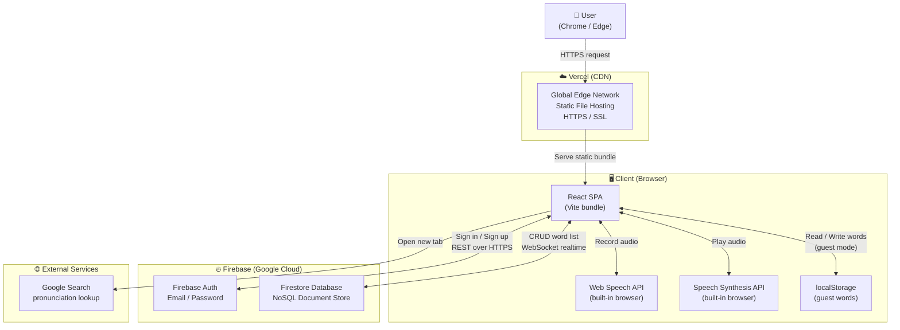
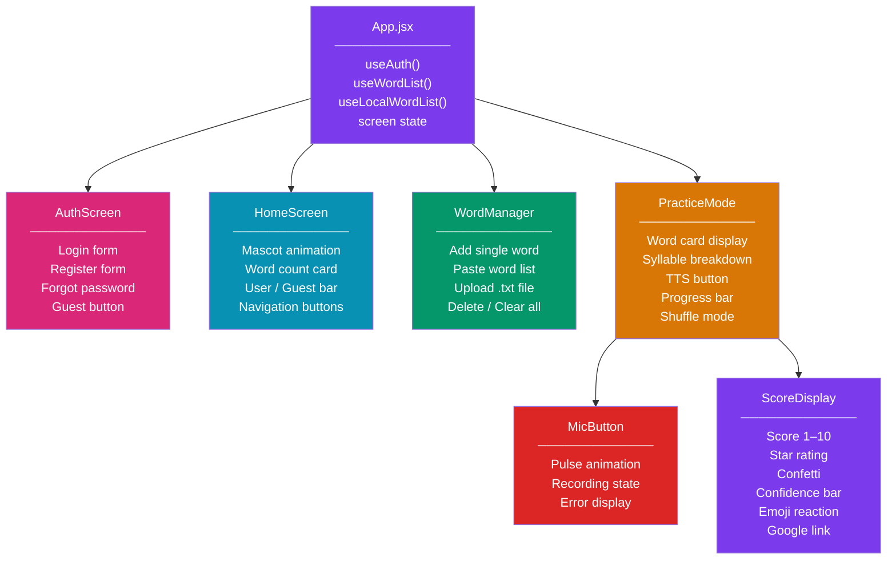
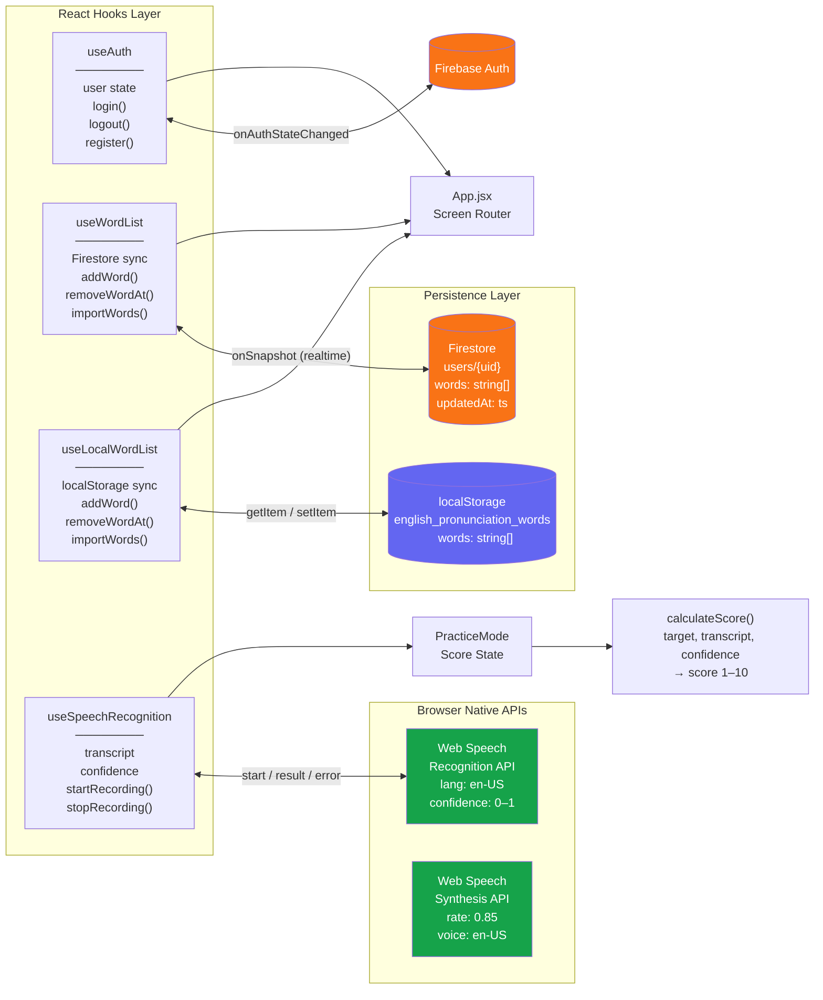
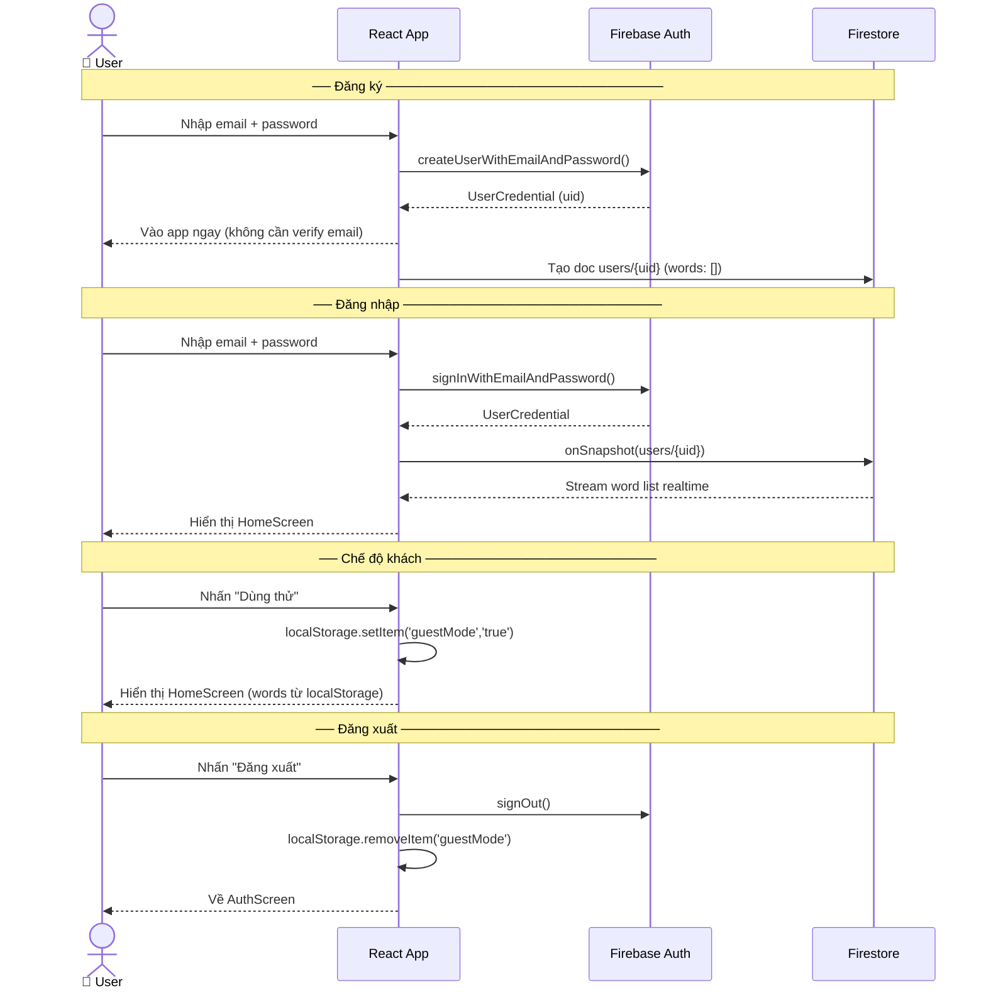
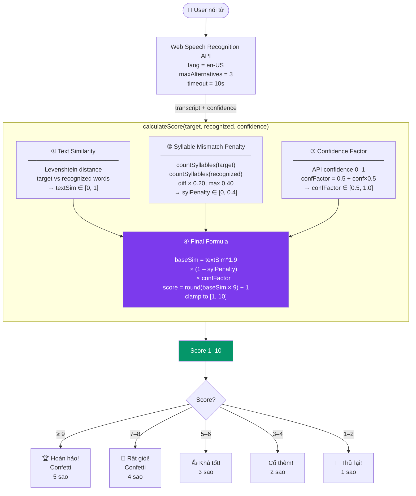
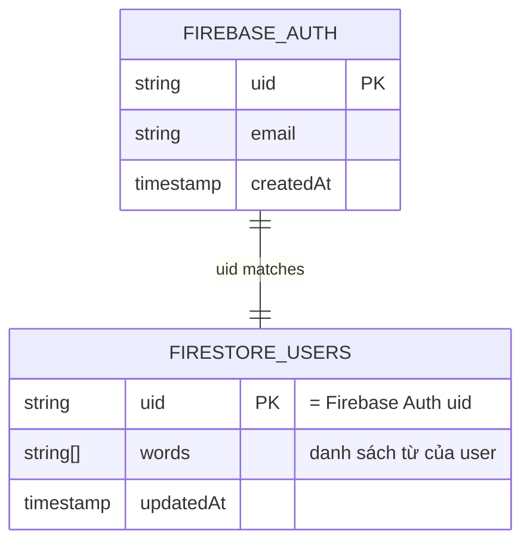
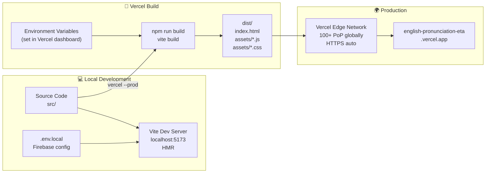

# System Design — Kiểm Tra Phát Âm Tiếng Anh

---

## 1. High-Level Architecture

---

## 2. Frontend Component Architecture

---

## 3. State & Data Flow

---

## 4. Authentication Flow

---

## 5. Pronunciation Scoring Pipeline

---

## 6. Firestore Data Model

---

## 7. Deployment Architecture

---

## 8. Tóm tắt kiến trúc

| Layer | Công nghệ | Vai trò |
|---|---|---|
| **UI** | React 19 + Tailwind CSS v3 | Render giao diện, quản lý state |
| **Build** | Vite 8 | Bundle, HMR, optimize |
| **Speech I/O** | Web Speech API (browser) | Nhận dạng giọng & phát âm mẫu |
| **Scoring** | Levenshtein + syllable + confidence | Chấm điểm 1–10 |
| **Auth** | Firebase Authentication | Email/password, session management |
| **Database** | Cloud Firestore | Lưu word list theo account, realtime sync |
| **Guest Storage** | Browser localStorage | Lưu word list không cần account |
| **Hosting** | Vercel (CDN) | Serve static bundle, HTTPS, global |
| **External** | Google Search | Tra cứu phát âm |

### Đặc điểm kiến trúc

- **Serverless hoàn toàn** — không có backend server riêng, toàn bộ logic chạy ở client
- **Realtime** — Firestore `onSnapshot` tự động sync word list khi có thay đổi
- **Offline-capable** — Guest mode dùng localStorage hoạt động không cần internet
- **Zero-cost** — Vercel free tier + Firebase Spark free tier đủ cho hàng nghìn users
- **Browser-native AI** — Speech Recognition chạy trên Google/Microsoft servers thông qua browser API, không cần tích hợp AI API riêng
